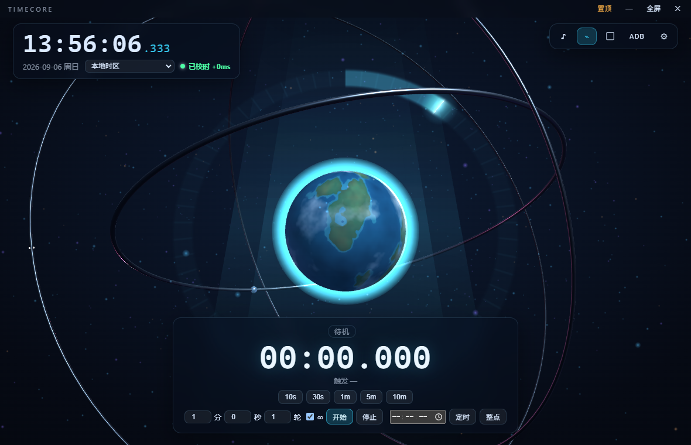

# TIMECORE · 悬浮式三维时间核心

高级、精密、可长期运行的桌面时间装置。程序化星球悬浮于玻璃质感的能量环中央，金属轨道环绕，到点瞬间星球释放能量——这不是一个普通网页时钟。

开源协议 MIT · Windows 桌面端（Electron）· 浏览器直接打开也可运行



## 下载安装

前往 [Releases](https://github.com/GardenOfKruse/timecore/releases) 页面：

- **TIMECORE-Setup-x.x.x.exe**：双击安装即用（推荐）
- **TIMECORE-Portable-x.x.x.exe**：免安装单文件版

> 安装包未做代码签名，首次运行如遇 SmartScreen 提示，选择「仍要运行」即可。

## ADB（可选功能）

ADB 齐射（到点自动点击安卓手机屏幕）为**可选功能**，默认关闭：

1. 手机开启「开发者选项 → USB 调试」并用数据线连接电脑（授权弹窗点允许）
2. 应用内 ADB 面板 → 「⬇ 下载 adb」：自动从 Google 官方源获取 platform-tools（约 6MB）并放置到位，无需手动安装
3. 已装过 adb 的用户无需下载——应用会自动检测 PATH / Android SDK / 手动指定的路径；无线设备用「IP:端口 → 连接」

手动下载地址（离线场景）：[Android 平台工具官方包](https://developer.android.com/tools/releases/platform-tools)

## 功能

- **时钟**：本地时区当前时间，毫秒 3 位数实时跳动；下拉切换任意 IANA 时区
- **网络校时**：多源采样计算偏移，失败平滑回退本地时间，显示永不倒退
- **倒计时**：按**绝对时间节点**对齐——`5m` = 每个整 5 分时刻触发；多轮/∞ 连跑；显著显示触发时刻
- **三阶段**：10s 外环预热 → 5s 能量增强 → 3s 强节奏脉冲 → 到点闪光/冲击波/粒子爆发（强度三档可调）
- **精准击拍**：空格/左键击拍，PERFECT/GREAT/GOOD/MISS 四档判定 + 连击
- **ADB 齐射**：连点/亮屏连点模板 + **截图选点**（在手机截图上点一下即得坐标）；三层时间补偿（全局提前量 + 传输延迟自动校准 + 设备端 sleep 预发射），到点偏差 ±45ms 内；配置修改即时生效
- **音效**：WebAudio 全合成，节拍音按绝对节点调度到音频时钟；提示/到点/击拍分轨音量

## 键位

| 键 | 功能 | 键 | 功能 |
|---|---|---|---|
| 空格 / 左键 | 击拍 | B | 自由节拍器 |
| F | 全屏 | C | 小窗模式 |
| M | 静音 | Esc | 关闭浮层 / 退全屏 |

## 架构

```
js/core.js       事件总线 + 工具
js/time-sync.js  网络校时（多源采样、单调时钟、平滑偏移）
js/clock.js      Intl 时区时钟（毫秒 3 位）
js/countdown.js  绝对节点倒计时状态机（对齐节点、多周期、三阶段）
js/beats.js      击拍判定（四档、连击、节拍器）
js/audio.js      WebAudio 合成音效 + 绝对节点调度 + 分轨音量
js/scene3d.js    程序化星球 + 能量环 shader + 轨道卫星 + 粒子 + 大气辉光
js/adb.js        ADB 齐射（设备管理/模板动作/截图选点/节点调度）
js/ui.js, main.js, test.js
electron/        桌面外壳（置顶/透明/全屏 + adb 下载与执行 IPC）
scripts/         make-icon.mjs（应用图标生成）
tests/           adb-e2e.mjs / fs-diag.mjs（CDP 真机验证脚本）
```

**时间设计**：显示时间 = 单调时钟 + 校准偏移（免疫系统时钟跳变）；偏移变化限速平滑（显示永不倒退）；倒计时与节拍全部基于 epoch 绝对节点，后台标签页/最小化由看门狗兜底触发。

## 开发

```bash
npm install
npm start          # 运行桌面端
npm run dist       # 打包 Windows 安装包 + 便携版（输出 dist/）
python -m http.server 8377   # 浏览器模式调试
```

自动化测试钩子：`?test=1` 注入 `window.__tc`；`?nosync=1` 强制本地时钟。真机验证脚本见 `tests/`。

## 发布流程（维护者）

1. 更新 `package.json` 的 `version`
2. 提交并打标签：`git tag v1.0.1 && git push origin v1.0.1`
3. GitHub Actions 自动构建并上传 Setup/Portable 到 Releases

## License

[MIT](LICENSE)
